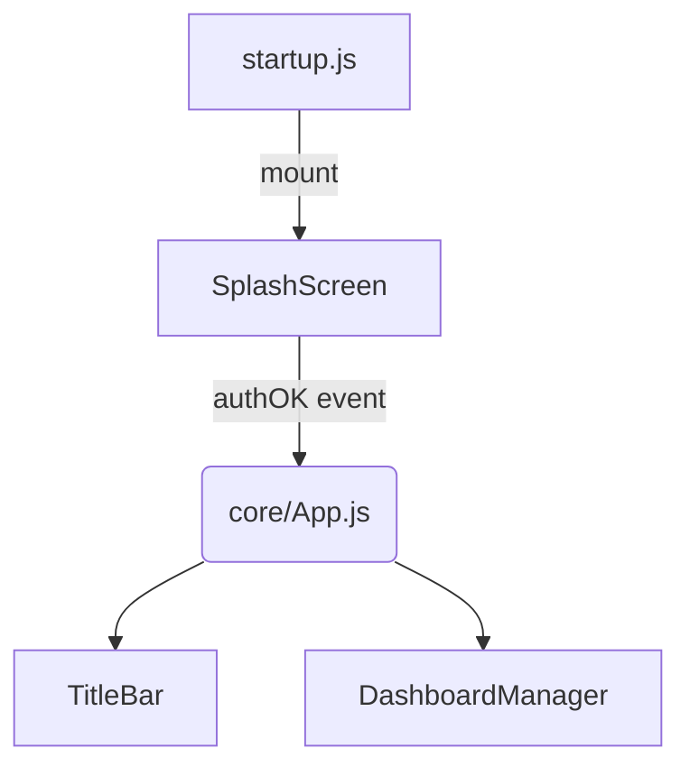

# 3dpmon v2 — ステップ⑦a

### スプラッシュ&認証ゲート実装仕様書（Codex 用）

| バージョン     | 日付         | 著者                  |
| --------- | ---------- | ------------------- |
| 0.1 Draft | 2025-07-xx | pumpCurry / ChatGPT |

---

## 1. ゴール

1. アプリ起動時に**スプラッシュ画面**を表示
2. 同画面内に **テンキー UI**（パスワード入力欄）

   * **現フェーズは “パスワード未設定”** → テンキー全ボタン `disabled` 表示
   * `Enter` ボタンだけ押下可能（あるいは **Enterキー**）
3. `Enter` 押下後に **AuthGate** が `true` を返し、
   **TitleBar + TabBar** を含む既存ダッシュボードが lazy-import される
4. 単体テスト（Vitest）と E2E（Playwright）緑

---

## 2. 画面遷移 & 責任分界点



| モジュール               | 主責務                                                  | 既存/新規        |
| ------------------- | ---------------------------------------------------- | ------------ |
| **startup.js**      | ルート要素に SplashScreen を mount                          | 既存 (変更)      |
| **SplashScreen.js** | ロゴ + テンキー UI / 認証判定 / authOK emit                    | ★新規          |
| **AuthGate.js**     | `getPasswordHash()` / `validate()` / `hasPassword()` | 既存 (拡張)      |
| **Keypad.js**       | 再利用可能な置換式テンキー                                        | ★新規 (parts/) |
| **App.js**          | ダッシュボード本体を lazy-import                               | 既存           |

*Dashboard 以降は触らない。*

---

## 3. UX 詳細

| 画面          | 要素              | 動作                                 |
| ----------- | --------------- | ---------------------------------- |
| **スプラッシュ**  | ロゴ SVG / App 名  | フェードイン 0.6 s                       |
|             | テンキー (3×4)      | 数・Clear・Enter / 現在は `disabled`（灰色） |
|             | ローディング円アニメ      | Enter 押下で数秒表示→フェードアウト              |
| **ダッシュボード** | TitleBar+TabBar | 既存実装                               |

Design token 例（SCSS 変数）

```scss
:root {
  --splash-bg: #111;
  --splash-logo: #68d;
  --key-disabled: #444;
  --key-enabled: #2d8;
}
```

---

## 4. ファイル/ディレクトリ

```
src/
 ├ core/
 │   └ AuthGate.js        # 拡張
 ├ splash/
 │   ├ SplashScreen.js    # ★
 │   └ Keypad.js          # ★
 ├ startup.js             # 変更
styles/
 ├ splash.scss            # ★
tests/
 ├ splash.test.js         # vitest
 └ e2e_splash.spec.ts     # playwright
```

---

## 5. 主要 API

### SplashScreen.js

```js
export default class SplashScreen {
  constructor(bus) { this.bus = bus; }
  mount(root) { /* DOM生成 + fadeIn */ }
  destroy() { /* remove */ }
}
```

* エンター押下 ⇒ `bus.emit('auth:ok')`

### AuthGate.js (変更点)

```js
export async function hasPassword() { return false; } // 未来拡張
export async function validate(pwd) { return true; }  // 今は即 OK
```

---

## 6. 実装ステップ（Codex へのタスクリスト）

| # | 作業内容                                                                                 | ファイル                                 |
| - | ------------------------------------------------------------------------------------ | ------------------------------------ |
| 1 | 新規 `styles/splash.scss` 作成                                                           | basic flex center + fade             |
| 2 | `src/splash/Keypad.js`                                                               | 3×4 ボタン: 数字=disabled, Enter=enabled  |
| 3 | `src/splash/SplashScreen.js`                                                         | ロゴ + Keypad + listener               |
| 4 | `core/AuthGate.js` 拡張                                                                | `hasPassword/validate` stub          |
| 5 | `startup.js` で<br>`await import('./splash/SplashScreen.js')`                         | auth:ok ➜ `import('./core/App.js')` |
| 6 | **Vitest** `splash.test.js`<br> - Splash mounts<br> - Enter emits auth:ok           |                                      |
| 7 | **Playwright** `e2e_splash.spec.ts`<br> - ページロード→ロゴあり<br> - Enter → TitleBar visible |                                      |
| 8 | `docs/develop/splash.md` 更新                                                          |                                      |

---

## 7. テスト詳細

### 7.1 splash.test.js (Vitest + happy-dom)

```js
import { bus } from '@core/EventBus';
import SplashScreen from '@splash/SplashScreen';
import { vi } from 'vitest';

it('emits auth:ok on Enter', () => {
  const spy = vi.fn();
  bus.on('auth:ok', spy);
  const s = new SplashScreen(bus);
  s.mount(document.body);
  document.querySelector('button.enter').click();
  expect(spy).toHaveBeenCalled();
});
```

### 7.2 e2e_splash.spec.ts

```ts
import { test, expect } from '@playwright/test';
test('splash -> dashboard', async ({ page }) => {
  await page.goto('/');
  await expect(page.getByRole('img', { name: /logo/i })).toBeVisible();
  await page.getByRole('button', { name: /enter/i }).click();
  await expect(page.getByRole('navigation')).toBeVisible(); // TitleBar
});
```

---

## 8. 受け入れ条件

1. `npm run dev` → スプラッシュ + テンキー表示
2. Enter→フェード→メニューバー描画
3. Vitest 全緑・Playwright 全緑
4. CI (GitHub Actions) 緑 / Codex タスク成功
5. コードカバレッジ ≥ 80 %

---

## 9. 依頼テンプレ（Codex “task description”）

```
### Goal
Implement SplashScreen + Keypad stub auth as per docs/develop/spec_step7_splash.md.
Steps:
1. Add styles/splash.scss
2. Create src/splash/Keypad.js (disabled numeric buttons, enabled Enter)
3. Create src/splash/SplashScreen.js (logo + keypad)
4. Extend core/AuthGate.js (stub hasPassword/validate)
5. Update startup.js to mount Splash, then lazy-load App on auth:ok
6. Add vitest tests in tests/splash.test.js
7. Add Playwright e2e in tests/e2e_splash.spec.ts
8. Update docs.

### Acceptance
- npm run dev shows splash, Enter loads dashboard
- tests & CI pass
```

---

## 10. 備考

*テンキー実装* は数行で OK（現フェーズは disabled）。
後続フェーズで `hasPassword()` が true の場合、テンキー活性化 & SHA-256 検証へ拡張します。

---
